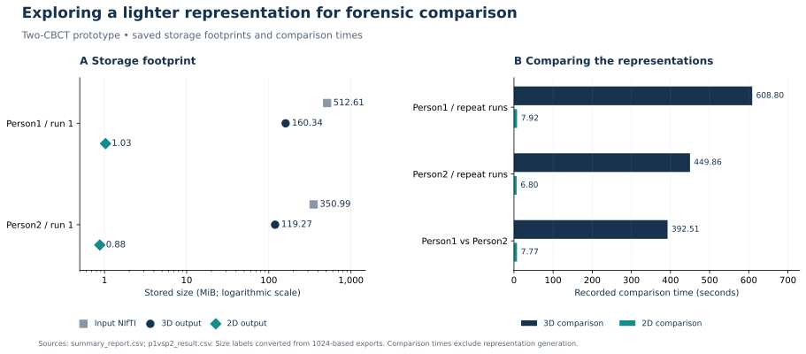
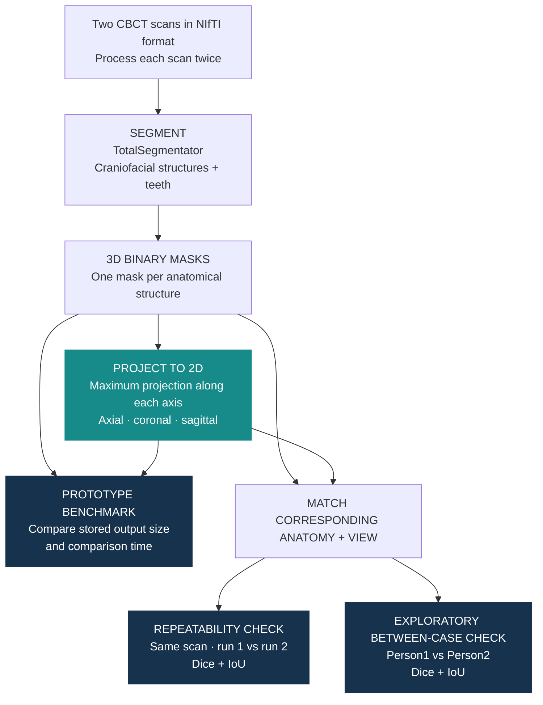

# Prototype 3D-to-2D Craniofacial Shape Analysis for Forensic Identification

A two-CBCT proof-of-concept exploring multi-view silhouettes as compact representations for potential forensic identification workflows. The prototype compares compact 2D projections of segmented craniofacial anatomy with the corresponding full 3D masks.

## Four prototype checks

| Check | Saved observation in this prototype |
|---|---|
| **1. Projection comparison is faster in the saved prototype runs.** | Across the three saved comparisons: **6.80–7.92 s for 2D**, versus **392.51–608.80 s for 3D**. |
| **2. Projection outputs require less stored space in the saved runs.** | Person1: **160.34 MB → 1.03 MB**. Person2: **119.27 MB → 897.77 KB** (3D mask output → 2D projection output, run 1). |
| **3. Repeated projections from the same scan are highly consistent.** | Projection Dice and IoU are **approximately 1.00** for both repeated-run comparisons. |
| **4. The two cases differ in this exploratory comparison.** | Person1 vs Person2: projection Dice **0.324**, IoU **0.313**. |

**Dice and IoU measure overlap:** both range from 0 (no overlap) to 1 (identical masks). Values above are rounded; the CSVs retain the original precision.

## How I approached it

**Idea:** preserve anatomical shape in three compact silhouettes per structure, then test whether the representation remains stable across repeated processing while reducing comparison cost and stored output size.

The prototype connects segmentation, projection and baseline Dice/IoU comparison. For the between-case comparison, 3D masks are resampled to the reference grid and 2D masks are resized when dimensions differ before overlap is calculated.

## Read the code and results

- [Segmentation and projection notebook](notebooks/3D_Shape_Analysis_Pipeline.ipynb)
- [Comparison notebook](notebooks/Comparison.ipynb)
- [Repeated-run results and storage](results/summary_report.csv)
- [Between-case results](results/p1vsp2_result.csv)
- [Figure script](scripts/render_figures.py) — regenerates the SVG overview from the two saved CSVs; no analysis rerun.
- [Prototype dependencies](requirements.txt)

## Scope and limitations

This repository is a **prototype, not a validated identification system**.

- "Repeated same-scan" comparisons use two pipeline runs on the **same CBCT scan**. They assess computational repeatability, not identification performance across independent examinations of the same person.
- The between-case comparison is exploratory. Its overlap scores may reflect **acquisition geometry, field of view, voxel spacing, positioning and alignment**, as well as genuine anatomical differences.
- Resampling and image resizing make the two saved cases computationally comparable, but the prototype does not yet perform anatomical registration or pose normalisation.
- The saved results come from **two cases** and do not estimate identification accuracy, sensitivity, specificity or population-level discrimination.
- Comparison times exclude segmentation and projection generation. Exact historical hardware conditions were not recorded.
- Stored-size differences reflect the historical NIfTI-mask and PNG-projection outputs; they should not be interpreted as an intrinsic compression ratio of 3D versus 2D representations.
- Source scans and masks are not distributed. Notebook code is preserved, and historical outputs are presented through the saved tables; no analysis was rerun for this public release.
- Exact historical package versions were not recorded. `requirements.txt` documents the main dependencies rather than recreating the original environment bit-for-bit.

## Intended next steps

A research-grade extension would test independent scans from the same individuals, standardise or register anatomy before comparison, evaluate genuine–impostor score distributions in a larger cohort, and quantify identification performance with appropriate validation metrics.

[Academic website](https://trungnb.github.io/) · [Reuse status](LICENSE)
