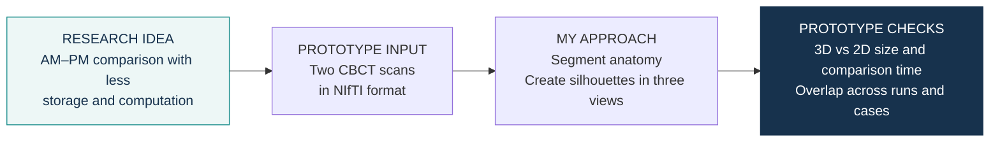
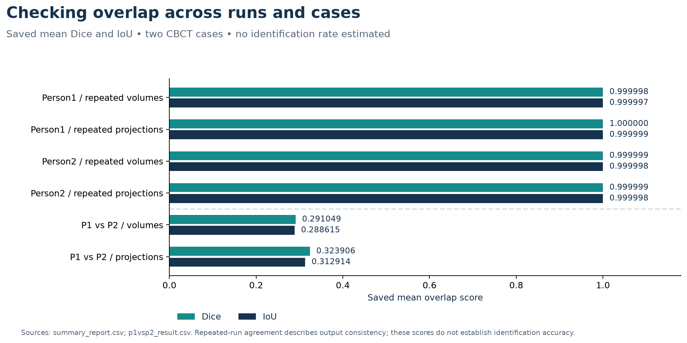

# 3D-to-2D craniofacial comparison · prototype

**Research idea:** explore multi-view 2D representations of teeth, jaws and sinuses
to reduce the storage and computational demands of forensic ante-mortem (AM) versus
post-mortem (PM) comparison.

**My approach:** apply existing segmentation models, turn anatomical masks into
three-view silhouettes, and compare the saved storage footprint, comparison time
and overlap scores of the 3D and 2D representations.

## What the prototype produced

| Case | Input NIfTI | Segmented 3D output | 2D projection output |
|---|---:|---:|---:|
| Person1 | 512.61 MB | 160.34 MB | 1.03 MB |
| Person2 | 350.99 MB | 119.27 MB | 897.77 KB |

Storage values are from run 1, preserving the export's unit labels. The figure converts
them to MiB using the notebook's 1024-based size formatter.

| Saved comparison | 3D comparison time | 2D comparison time |
|---|---:|---:|
| Person1, repeated runs | 608.80 s | 7.92 s |
| Person2, repeated runs | 449.86 s | 6.80 s |
| Person1 vs Person2 | 392.51 s | 7.77 s |

These recorded footprints and comparison times illustrate the resource question
behind the prototype. They do not include segmentation or projection-generation time
in the comparison timings; hardware conditions are not established by the saved tables.

View saved overlap scores

Repeated-run volume Dice was approximately 0.999998–0.999999. Between Person1 and
Person2, mean Dice was 0.291049 for volumes and 0.323906 for projections.
These describe overlap of the saved representations. Identification accuracy and
agreement with anatomical reference annotations have not been established.

## What I built

- Connected existing TotalSegmentator tasks to NIfTI input, output folders, and timing logs.
- Exported binary silhouettes in axial, coronal and sagittal views.
- Implemented baseline Dice / IoU comparisons and recorded 3D / 2D storage and comparison time.

**Current scope:** two CBCT scans, with repeated-run and between-case comparisons.
AM–PM identification is the intended application. The broader proposal plans head CT
data, larger reference databases and simulations of missing structures;
these extensions are [mapped separately from the implemented work](docs/methodology.md).

## Notebook map

| Notebook | Role |
|---|---|
| [3D Shape Analysis Pipeline](notebooks/3D_Shape_Analysis_Pipeline.ipynb) | Segmentation and projection export |
| [Comparison](notebooks/Comparison.ipynb) | Repeated-run and between-case comparisons |
| [Tooth and pulp volume exploration](notebooks/sex%26age.ipynb) | Supplementary volume features; no age/sex prediction result is reported |

**Data:** selected derived results are included; source CBCT scans and segmentation
masks are not distributed. [Input requirements](data/README.md).

## Explore the project

[Methods](docs/methodology.md) · [Data and provenance](docs/data-provenance.md) · [Saved tables](results/README.md) · [Viewing / chart rendering](docs/environment.md)

**Status:** exploratory prototype. Results shown here were saved during earlier experiments;
the notebooks were not rerun for this release. Figures were rendered from saved tables.

**Author:** [trungnb](https://github.com/trungnb) · [Academic website](https://trungnb.github.io/)

Research and educational use only; this prototype has not been clinically validated.
See [licensing status](LICENSE) before reuse.
