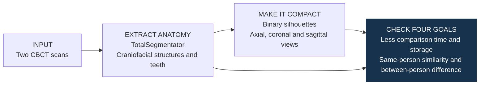

# 3D-to-2D craniofacial comparison

A two-CBCT prototype exploring multi-view silhouettes for forensic identification.
The idea is to compare compact 2D projections of segmented anatomy instead of comparing
only the full 3D volumes.

## Four prototype goals

| Goal | Saved result in this prototype |
|---|---|
| **1. Comparing projections takes less time than comparing 3D volumes.** | Across the three saved comparisons: **6.80–7.92 s for 2D**, versus **392.51–608.80 s for 3D**. |
| **2. Projections need less storage than 3D volumes.** | Person1: **160.34 MB → 1.03 MB**. Person2: **119.27 MB → 897.77 KB** (3D output → 2D output, run 1). |
| **3. Projections from the same person are similar.** | Projection Dice is **approximately 1.00** for both repeated-run comparisons. |
| **4. Projections from two different people differ.** | Person1 vs Person2: projection Dice **0.324**. |

**Dice measures overlap: a score closer to 1 means more similar projections.** Values above are rounded; the CSVs retain the original precision.

## How I approached it

I connected the segmentation and projection steps, implemented baseline Dice / IoU
comparisons, and recorded output sizes and comparison times.

## Read the code and results

- [Segmentation and projection notebook](notebooks/3D_Shape_Analysis_Pipeline.ipynb)
- [Comparison notebook](notebooks/Comparison.ipynb)
- [Repeated-run results and storage](results/summary_report.csv)
- [Between-person results](results/p1vsp2_result.csv)
- [Figure script](scripts/render_figures.py) — reads the two saved CSVs; requires Matplotlib.

**Scope:** “same person” here means two pipeline runs on the **same CBCT scan**.
The saved comparisons demonstrate these observations in two cases; they do not
estimate identification accuracy in a larger population. AM–PM matching is the
intended research application.

**Reading the numbers:** comparison times exclude segmentation and projection generation.
Storage strings retain their original labels; the figure uses MiB because the original
formatter divided by 1024. Exact hardware conditions are not documented in the tables.

Source scans and masks are not distributed. Notebook code is preserved; historical
outputs are presented through the saved tables. No analysis was rerun for this release.

[trungnb](https://github.com/trungnb) · [Academic website](https://trungnb.github.io/)
