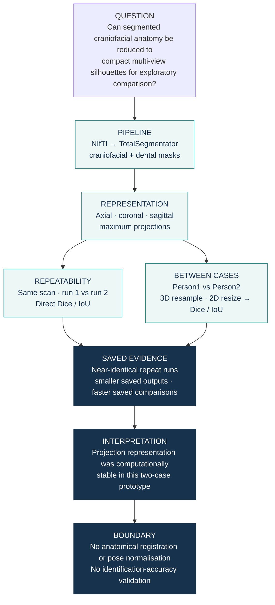

# Prototype 3D-to-2D Craniofacial Shape Analysis for Forensic Identification

A two-CBCT proof-of-concept exploring multi-view silhouettes as compact representations for potential forensic identification workflows. The prototype compares compact 2D projections of segmented craniofacial anatomy with the corresponding full 3D masks.

## Four prototype checks

| Check | Saved observation in this prototype |
|---|---|
| **1. Projection comparison is faster in the saved prototype runs.** | Across the three saved comparisons: **6.80–7.92 s for 2D**, versus **392.51–608.80 s for 3D**. |
| **2. Projection outputs require less stored space in the saved runs.** | Person1: **160.34 MB → 1.03 MB**. Person2: **119.27 MB → 897.77 KB** (3D mask output → 2D projection output, run 1). |
| **3. Repeated projections from the same scan are highly consistent.** | Projection Dice and IoU are **approximately 1.00** for both repeated-run comparisons. |
| **4. The two cases differ in this exploratory comparison.** | Person1 vs Person2: projection Dice **0.324**, IoU **0.313**. |

**Dice and IoU measure overlap:** both range from 0 (no overlap) to 1 (identical masks). Values above are rounded; the CSVs retain the original precision.

## Run the pipeline in Google Colab

The repository now has a dedicated **Open in Colab → choose dataset → select scans → Run** entrypoint:

- [Open-in-Colab runner](notebooks/Open_in_Colab_Run.ipynb)
- Put `.nii` / `.nii.gz` CBCT volumes in `My Drive/Pipeline/Data/`.
- Select one or more scans in the notebook.
- The runner records the assigned GPU, Python/PyTorch versions and TotalSegmentator version.
- Segmentation and projection outputs are saved under `My Drive/Pipeline/runs/<run_id>/`.
- The original notebooks remain available for reproducing the historical analysis structure.

For a first public-data smoke test, use a single CBCT volume. Suitable public starting points include ToothFairy3 (NIfTI CBCT; registration required) and ToothFairy2 (official download requires an account).

## How I approached it

The two comparison branches answer different questions. Repeated same-scan runs assess computational repeatability. The exploratory between-case branch makes the saved cases computationally comparable by resampling 3D masks to the reference grid and resizing 2D masks when dimensions differ before Dice/IoU are calculated; it does not perform anatomical registration.

## Read the code and results

- [Segmentation and projection notebook](notebooks/3D_Shape_Analysis_Pipeline.ipynb)
- [Comparison notebook](notebooks/Comparison.ipynb)
- [Repeated-run results and storage](results/summary_report.csv)
- [Between-case results](results/p1vsp2_result.csv)
- [Figure script](scripts/render_figures.py) — regenerates the SVG overview from the two saved CSVs; no analysis rerun.
- [Prototype dependencies](requirements.txt)

## Scope and limitations

This repository is a **prototype, not a validated identification system**.

- "Repeated same-scan" comparisons use two pipeline runs on the **same CBCT scan**. They assess computational repeatability, not identification performance across independent examinations of the same person.
- The between-case comparison is exploratory. Its overlap scores may reflect **acquisition geometry, field of view, voxel spacing, positioning and alignment**, as well as genuine anatomical differences.
- Resampling and image resizing make the two saved cases computationally comparable, but the prototype does not yet perform anatomical registration or pose normalisation.
- The saved results come from **two cases** and do not estimate identification accuracy, sensitivity, specificity or population-level discrimination.
- Comparison times exclude segmentation and projection generation. Exact historical hardware conditions were not recorded.
- Stored-size differences reflect the historical NIfTI-mask and PNG-projection outputs; they should not be interpreted as an intrinsic compression ratio of 3D versus 2D representations.
- Source scans and masks are not distributed. Notebook code is preserved, and historical outputs are presented through the saved tables; no analysis was rerun for this public release.
- Exact historical package versions were not recorded. `requirements.txt` documents the main dependencies rather than recreating the original environment bit-for-bit.

## Intended next steps

A research-grade extension would test independent scans from the same individuals, standardise or register anatomy before comparison, evaluate genuine–impostor score distributions in a larger cohort, and quantify identification performance with appropriate validation metrics.

[Academic website](https://trungnb.github.io/) · [Reuse status](LICENSE)
