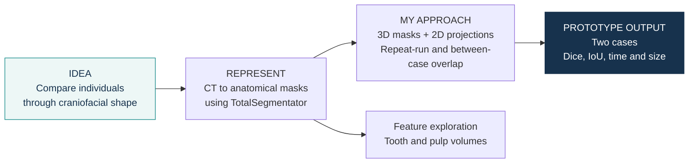
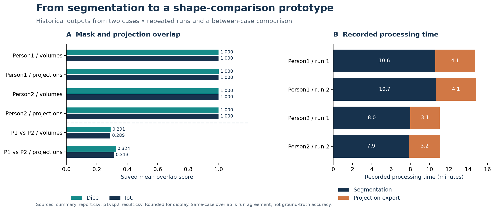

# Craniofacial shape comparison · prototype

**Idea:** explore craniofacial shape as a representation for comparing individuals.
**My approach:** turn CT volumes into anatomical masks and compact 2D projections,
then compare repeated runs and two example cases using overlap scores.

## What the prototype produced

| Saved comparison | Mean Dice | Mean IoU |
|---|---:|---:|
| Person1, repeated runs · volumes | 0.999998 | 0.999997 |
| Person2, repeated runs · volumes | 0.999999 | 0.999998 |
| Person1 vs Person2 · volumes | 0.291049 | 0.288615 |
| Person1 vs Person2 · projections | 0.323906 | 0.312914 |

These are saved overlap comparisons. Repeated-run agreement describes consistency
between outputs; it does not measure accuracy against annotated anatomy or establish
identification performance. Values and recorded processing times are available in the
[source tables](results/README.md).

## What I built

- Connected existing TotalSegmentator tasks to NIfTI input, output folders, and timing logs.
- Exported orthogonal binary projections and compared 3D / 2D representations.
- Summarized processing time, output size, Dice and IoU; explored tooth and pulp volume features.

## Notebook map

| Notebook | Role |
|---|---|
| [3D Shape Analysis Pipeline](notebooks/3D_Shape_Analysis_Pipeline.ipynb) | Segmentation and projection export |
| [Comparison](notebooks/Comparison.ipynb) | Repeated-run and between-case comparisons |
| [Tooth and pulp volume exploration](notebooks/sex%26age.ipynb) | Volume features; the original filename is `sex&age`, but no age/sex prediction result is claimed |

**Data:** two cases labeled Person1 and Person2. Source CT/NIfTI images and segmentation
masks are not distributed. [Input requirements](data/README.md).

## Explore the project

[Methods](docs/methodology.md) · [Data and provenance](docs/data-provenance.md) · [Saved tables](results/README.md) · [Viewing / chart rendering](docs/environment.md)

**Status:** exploratory prototype. Results shown here were saved during earlier experiments;
the notebooks were not rerun for this release. Figures were rendered from saved tables.

**Author:** [trungnb](https://github.com/trungnb) · [Academic website](https://trungnb.github.io/)

Research and educational use only; this prototype has not been clinically validated.
See [licensing status](LICENSE) before reuse.
